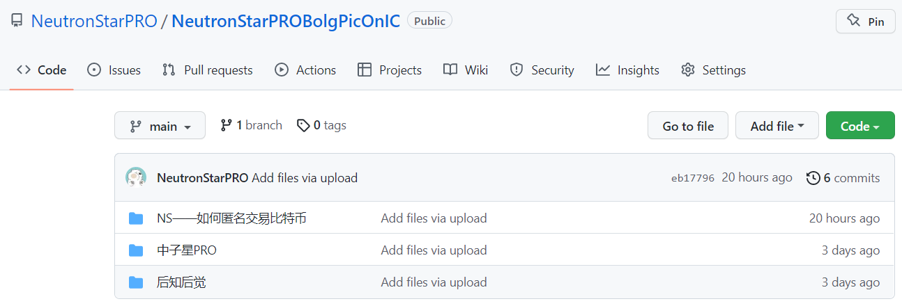
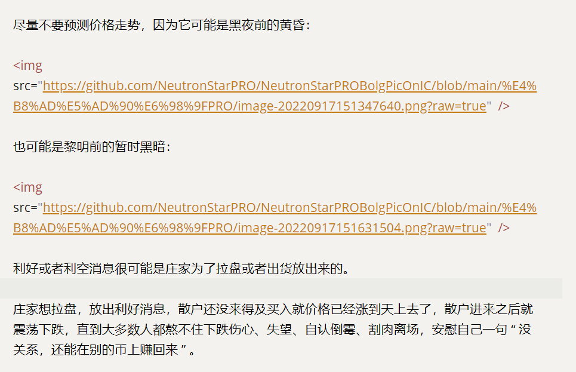

有 2 种方法可以添加图片：

* 把图片上传到 Github 仓库
* 把图片放进 blog/static/img 目录下，和文章一起生成静态网页


## 把图片上传到 Github 仓库

优点：网页打开速度会非常快、网站消耗的 cycles 会更少

缺点：当文章里有很多图片时，操作比较麻烦

### 怎么做

#### 使用Github

先打开 [GitHub](https://github.com) ，然后  登录 / 注册  账户。

#### 新建一个仓库

然后新建一个专门存放图片的仓库。


#### 给图片分类

为了方便管理，请先把图片放进不同的文件夹里，建议每个文章对应一个文件夹。

比如：

我的文章 “ 中子星笔记 ” 里用了 25 张图片，就在电脑里新建一个文件夹，命名 “ 中子星笔记 ” ，然后把图片放进这个文件夹里


#### 上传图片

把装有图片的文件夹上传到仓库中。

点击 “ Upload flies ” ，在打开的页面里上传图片文件夹即可：


上传后效果：




## 和文章一起生成静态网页

优点：操作很简单

缺点：打包生成的网页比较大，网站的打开速度可能会慢一点

### 怎么做

把装有图片的文件夹放进 blog/static/img 目录下。

在文章中引入图片时，加入这个标签：比如我要引入 XXX.png 图片

```html

```

注意：前面的 `` 不能改，只能替换那个 “ 中子星笔记/XXX.png ” （文件夹名/图片文件名）

