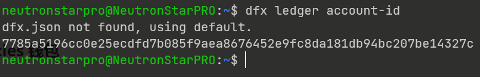
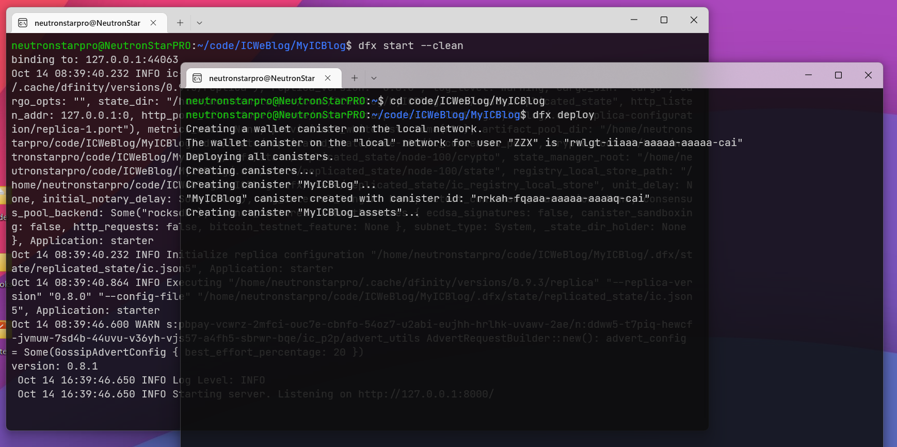
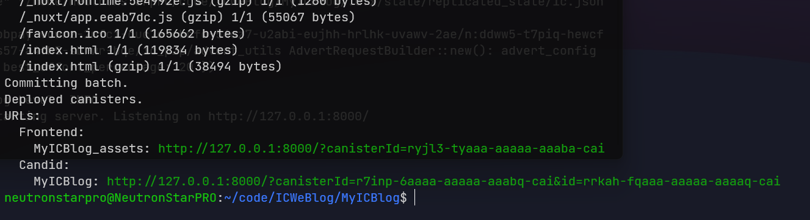
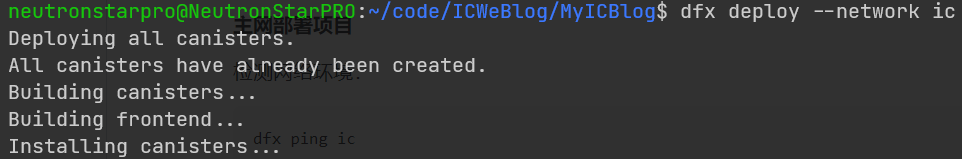
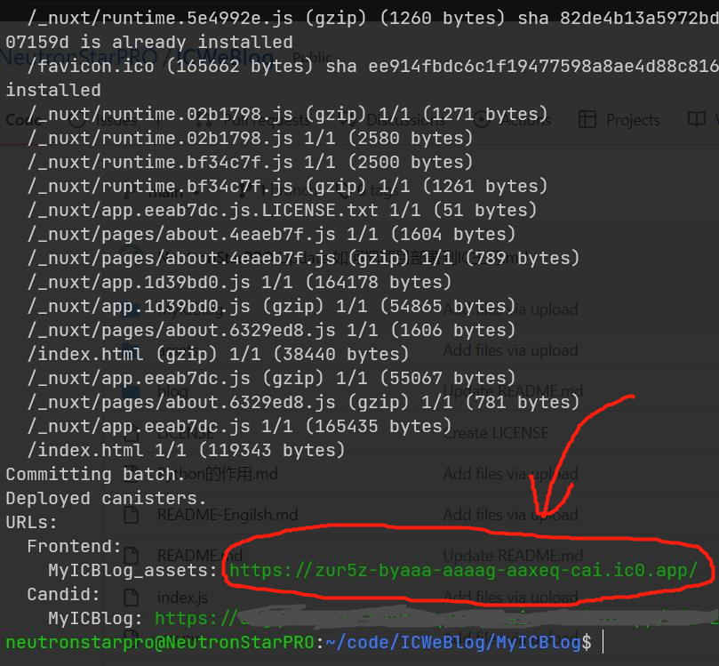

## 把 MyICBlog 项目部署到 IC 主网

#### 如何安装 dfx 开发工具（ IC 开发 SDK ）

https://internetcomputer.org/docs/current/developer-docs/build/install-upgrade-remove


#### 创建 cycles 钱包

命令行转到在 MyICBlog 目录下

显示接收转账的 account-id（地址） : 

```bash
dfx ledger account-id
```



往显示出的地址里发一些 ICP 。（目前 ICP 5U 一个所以发 1.11 个 ICP 即可）

这个地址是你电脑中 dfx 的地址。然后输入下面这个命令检查一下收到了 ICP 没：

```bash
dfx ledger --network ic balance
```

收到了就用命令把 ICP 转换成 Cycles ：

```bash
dfx ledger --network ic create-canister $(dfx identity get-principal) --amount 1.1
```

安装 cycles 钱包：

```bash
dfx identity --network ic deploy-wallet <这里填canister的id>
```

注意最后那里要换成上一条命令输出的 canister id 。例如：

```bash
dfx identity --network ic deploy-wallet aaaaa-aaaaa-aaaaa-aaaaa-aaa
```

查看当前钱包的 cycles 余额：

```bash
dfx wallet --network ic balance
```

然后就可以部署网站了。

<br>

先在命令行中转到 MyICBlog 的目录 （注意：是在 MyICBlog 目录下操作，不是在 ICWeBlog 下）

安装依赖包

```bash
npm install
```

#### 本地部署测试

先在本地环境测试一下效果：

打开 2 个命令行窗口，一个输入：

```bash
dfx start --clean
```

在另一个命令行里输入：

```bash
dfx deploy
```



像下图这样，没有报错的话，就可以关掉这 2 个命令窗口了。




#### 主网部署项目

检测网络环境：

```bash
dfx ping ic
```

部署项目：



```bash
dfx deploy --network ic
```




<br>

#### dfx 常用命令  (dfx版本：0.9.3)

```bash
# 查询dfx版本
dfx --version
# 更新dfx
dfx upgrade
```


##### identity 相关：

```bash
# 列出所有identity
dfx identity list
# 显示当前的principal-id
dfx identity get-principal
# 查询开发者身份的名字
dfx identity whoami
# 显示接收转账的account-id
dfx ledger account-id
# 从一个账户转账到另一个账户
dfx --identity xxxx ledger --network ic transfer --memo 0 --amount 0.5
# 创建新的identity身份，命名为neutronstarpro
dfx identity new neutronstarpro
# 使用某个identity身份
dfx identity use neutronstarpro
# 当前账户还有多少ICP
dfx ledger --network ic balance
# 名为nuetronstarpro的身份的账户还有多少ICP
dfx --identity neutronstarpro ledger --network ic balance
```


##### wallet 相关：

```bash
# 显示当前cycles钱包的id
dfx identity --network ic get-wallet
# 创建一个canister并把账户里的10个icp转换成cycles为canister充值；--amount意思是将指定的ICP转换为cycles
dfx ledger --network ic create-canister $(dfx identity get-principal) --amount 10
# 在canister里安装cycles钱包，安装之后这个canister就变成钱包专属canister了
dfx identity --network ic deploy-wallet <canister-id>
# 当前钱包的cycles余额
dfx wallet --network ic balance
# 给钱包充值
dfx wallet --network ic send $(dfx --identity developer identity get-wallet) 80000590000
```


##### deploy 部署相关：

```bash
# 启动本地环境
dfx start
# 清除缓存并启动本地环境
dfx start --clean
# 在后台启动本地环境，看不见它的信息
dfx start --background
# 启动模拟器模式本地环境
dfx start --emulator
# 启动无延迟响应模式的本地环境（默认的本地环境会模拟IC的网络，人为制造一些延迟，加入了达成共识的时间）
dfx start -no-artificial-delay
# 部署到本地
dfx deploy
# 关闭本地计算机运行的本地容器执行环境进程
dfx stop
# ====================================================================================
# 检查IC网络的当前状态和是否能连接
dfx ping ic
# 部署到IC网络
dfx deploy --network ic
# 部署到IC网络，指定了每个canister里充 1T cycles
dfx deploy --network ic --with-cycles=1000000000000
```


##### canister 相关：

```bash
# 查询自己身份下名为hello_assets的canister-id
dfx canister --network ic id hello_assets
# =============================================================
# 获取所有canister状态，--all可以换成canister的id或者canister的名字
dfx canister --network ic status --all
# 停止canister运行
dfx canister --network ic stop --all
# 删除canister里的代码
dfx canister --network ic uninstall-code --all
# 删除canister并回收cycles
dfx canister --network ic delete --all
```

